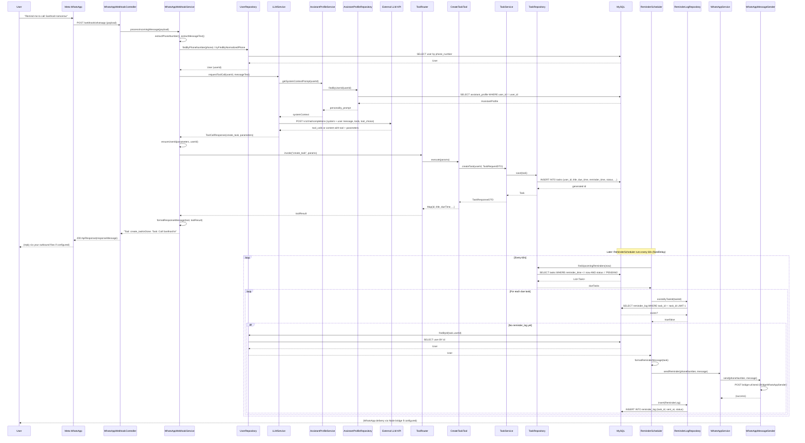

# Complete Data and Execution Flow — Personal Assistant System

This document explains the full data and execution flow of the Clario personal assistant, with exact code paths for each lifecycle.

---

## 1. Inbound WhatsApp Flow

**Trace:** Webhook receipt → identity/message extraction → user resolution → assistant context → LLM tool decision → tool execution → response text back to controller.

### 1.1 Entry: `WhatsAppWebhookController`

- **Endpoint:** `POST /webhook/whatsapp`
- **Handler:** `handleIncoming(@RequestBody WhatsAppWebhookPayload payload)`
- **Validation:** Returns 400 if `payload == null` or `payload.getObject()` is not `"whatsapp_business_account"`.
- **Success path:** Calls `webhookService.processIncomingMessage(payload)` and wraps the returned string in `WhatsAppWebhookResponse` inside `ApiResponse.ok(...)` with 200. No outbound WhatsApp send happens here—only the response text is formulated for the client/Meta.

```65:76:src/main/java/com/assistant/core/controller/WhatsAppWebhookController.java
    @PostMapping(...)
    public ResponseEntity<ApiResponse<WhatsAppWebhookResponse>> handleIncoming(@RequestBody(required = false) WhatsAppWebhookPayload payload) {
        ...
        String responseText = webhookService.processIncomingMessage(payload);
        WhatsAppWebhookResponse response = new WhatsAppWebhookResponse(responseText);
        return ResponseEntity.ok(ApiResponse.ok(response));
```

### 1.2 `WhatsAppWebhookService.processIncomingMessage`

1. **Extract identity and text**
   - `extractPhoneNumber(payload)`: navigates `payload.getEntry().get(0).getChanges().get(0).getValue().getMessages().get(0).getFrom()` (e.g. `919876543210`).
   - `extractMessageText(payload)`: same path, then `message.getText().getBody()`.
   - If phone or message is missing/blank → `IllegalArgumentException` → 400.

2. **Resolve user**
   - `userRepository.findByPhoneNumber(phoneNumber)` then `tryFindByNormalizedPhone(phoneNumber)` (strip non-digits, try with/without `91` prefix, or with `+`).
   - If no user found → `IllegalArgumentException` → 400.

3. **LLM tool decision**
   - `llmService.requestToolCall(user.getId(), messageText)` → returns `ToolCallResponse(tool, parameters)` (e.g. `create_task` + map of `title`, `dueTime`, `reminderTime`, etc.).

4. **Run tool and format response**
   - `toolRouter.invoke(toolCall.tool(), ensureUserId(toolCall.parameters(), user.getId()))` so `userId` is always in the map.
   - `formatResponseMessage(toolCall.tool(), toolResult)` builds the string (e.g. "Tool: create_task\nDone. Task: Call Santhosh\n") returned to the controller.

So the **assistant_profile is not loaded in the webhook layer**; it is loaded inside the LLM path.

### 1.3 Loading assistant_profile and passing context to LLM

- **Where:** `LLMService.requestToolCall(userId, userMessage)`.
- **Context loading:**
  - `getSystemContextForUser(userId)` → `assistantProfileService.getSystemContextPrompt(userId)`.
  - That calls `assistantProfileRepository.findByUserId(userId)` (SQL: `SELECT ... FROM assistant_profile WHERE user_id = :user_id`).
  - Returns `profile.getPersonalityPrompt()` if present and non-blank; otherwise `AssistantProfileService.DEFAULT_PERSONALITY`.

```54:56:src/main/java/com/assistant/core/mcp/LLMService.java
    public String getSystemContextForUser(Long userId) {
        return assistantProfileService.getSystemContextPrompt(userId);
    }
```

```60:66:src/main/java/com/assistant/core/service/AssistantProfileService.java
    public String getSystemContextPrompt(Long userId) {
        return assistantProfileRepository.findByUserId(userId)
                .map(AssistantProfile::getPersonalityPrompt)
                .filter(p -> p != null && !p.isBlank())
                .orElse(DEFAULT_PERSONALITY);
    }
```

- **LLM request:**
  - `buildToolDefinitions()` builds the tools array from `toolRouter.listTools()` (each tool’s `name`, `description`, and a fixed JSON schema for parameters).
  - HTTP `POST` to `{baseUrl}/v1/chat/completions` with:
    - `model`: `"gpt-5.1-codex-mini"`
    - `messages`: `[ { "role": "system", "content": systemContext }, { "role": "user", "content": userMessage } ]`
    - `tools`: tool definitions, `tool_choice`: `"required"`
  - Response is parsed: first `parseToolCalls(message)` (native `tool_calls`), then fallback `parseContentAsToolJson(message)` (JSON in `content` with `tool` and `parameters`). Result is `ToolCallResponse(toolName, parameters)`.
  - If base URL is blank or the request fails, `placeholderResponse(userId)` returns `ToolCallResponse("list_tasks", Map.of("userId", userId))`.

**Summary:** Inbound path is **Controller** → **WebhookService** (extract phone/message, resolve user) → **LLMService** (load assistant_profile via AssistantProfileService/AssistantProfileRepository, call LLM with system + user message, return tool + parameters) → **ToolRouter** (invoke tool) → **formatResponseMessage** → response back to controller.

---

## 2. MCP & Tool Routing Flow

**How the LLM’s tool choice becomes a Java call and then MySQL via NamedParameterJdbcTemplate (no raw SQL from LLM).**

### 2.1 LLM decides the tool

- `LLMService.requestToolCall(userId, userMessage)` returns a `ToolCallResponse`:
  - `tool`: one of `"create_task"`, `"list_tasks"`, `"add_person"`, `"retrieve_people"`.
  - `parameters`: map of arguments (e.g. `title`, `description`, `dueTime`, `reminderTime` for `create_task`). The webhook layer injects `userId` via `ensureUserId(parameters, user.getId())` before invocation.

### 2.2 ToolRouter: tool name → Java tool

- **Component:** `ToolRouter` (Spring `@Component`), receives `List<Tool>` by constructor (all `Tool` beans: `CreateTaskTool`, `ListTasksTool`, `AddPersonTool`, `RetrievePeopleTool`).
- **Allowlist:** `ALLOWED_TOOLS = Set.of("create_task", "list_tasks", "add_person", "retrieve_people")`. Only these names are accepted.
- **invoke(toolName, arguments):**
  - `findTool(toolName)` checks allowlist and finds the bean where `tool.name().equalsIgnoreCase(toolName)`.
  - If not found → `IllegalArgumentException`.
  - Otherwise `tool.execute(arguments)` and return the result map.

So the parsed LLM output (tool name + parameters map) is passed to the router; the router maps the string to one concrete `Tool` implementation and calls `execute(parameters)`.

```47:52:src/main/java/com/assistant/core/mcp/ToolRouter.java
    public Map<String, Object> invoke(String toolName, Map<String, Object> arguments) {
        Tool tool = findTool(toolName)
                .orElseThrow(() -> new IllegalArgumentException("Unknown or disallowed tool: " + toolName));
        log.debug("Invoking tool: {}", toolName);
        return tool.execute(arguments != null ? arguments : Map.of());
    }
```

### 2.3 CreateTaskTool → TaskService → MySQL (no raw SQL)

- **CreateTaskTool.execute(arguments):**
  - Reads `userId`, `title`, `description`, `dueTime`, `reminderTime` from the map (`userId` and `title` required).
  - Builds `TaskRequestDTO`, then calls `taskService.createTask(userId, request)`.
- **TaskService.createTask:**
  - Sanitizes title/description via `InputSanitizer`, creates `Task` entity, sets `status = "PENDING"`, calls `taskRepository.save(task)`.
- **TaskRepository (NamedParameterJdbcTemplate; fixed SQL only):**
  - **Insert:** `insert(task)` uses fixed SQL:  
    `INSERT INTO tasks (user_id, title, description, due_time, reminder_time, status) VALUES (?, ?, ?, ?, ?, ?)`  
    with positional parameters from the `Task` object and `KeyHolder` for generated ID.
  - **Update:** `update(task)` uses fixed `UPDATE tasks SET ... WHERE id = :id` with `MapSqlParameterSource`.
  - All other methods (`findById`, `findByUserIdAndStatus`, `findUpcomingReminders`, etc.) use fixed SQL and `MapSqlParameterSource`/`RowMapper`.

So: **LLM → ToolCallResponse → ToolRouter → CreateTaskTool → TaskService → TaskRepository → NamedParameterJdbcTemplate** with only predefined SQL. No dynamic or user/LLM-supplied SQL is ever executed.

---

## 3. Asynchronous Reminder Flow

**ReminderScheduler cron, reminder_log for deduplication, and WhatsAppService.**

### 3.1 Schedule and entry point

- **Class:** `ReminderScheduler` (Spring `@Component`).
- **Method:** `sendDueReminders()`, annotated `@Scheduled(fixedDelay = 60000)` (runs 60 seconds after the previous run completes).

```45:47:src/main/java/com/assistant/core/scheduler/ReminderScheduler.java
    @Scheduled(fixedDelay = 60000)
    public void sendDueReminders() {
        Instant now = Instant.now();
```

### 3.2 Query for pending tasks

- `taskRepository.findUpcomingReminders(now)`:
  - SQL:  
    `SELECT ... FROM tasks WHERE reminder_time IS NOT NULL AND reminder_time <= :before AND status = :status ORDER BY reminder_time`  
    with `before = now`, `status = 'PENDING'`.
  - Returns tasks whose reminder time has passed and are still PENDING.

```69:75:src/main/java/com/assistant/core/repository/TaskRepository.java
    public List<Task> findUpcomingReminders(Instant before) {
        String sql = "SELECT ... FROM tasks WHERE reminder_time IS NOT NULL AND reminder_time <= :before AND status = :status ORDER BY reminder_time";
        MapSqlParameterSource params = new MapSqlParameterSource()
                .addValue("before", Timestamp.from(before))
                .addValue("status", "PENDING");
        return jdbcTemplate.query(sql, params, ROW_MAPPER);
    }
```

### 3.3 reminder_log: prevent duplicate alerts

- For each task in `dueTasks`:
  - `reminderLogRepository.existsByTaskId(task.getId())`:
    - SQL: `SELECT ... FROM reminder_log WHERE task_id = :task_id LIMIT 1`.
  - If a row exists → task is skipped (already reminded).
  - So **reminder_log** is the idempotency guard: once a reminder is sent for a task, that task is not sent again by the scheduler.

```52:56:src/main/java/com/assistant/core/scheduler/ReminderScheduler.java
        for (Task task : dueTasks) {
            if (reminderLogRepository.existsByTaskId(task.getId())) {
                log.trace("Task {} already has reminder_log, skipping", task.getId());
                continue;
            }
```

### 3.4 User lookup and send

- `userRepository.findById(task.getUserId())`. If no user → log and skip.
- `formatReminderMessage(task)`: e.g. `"Reminder: <title> (due <dueTime>)\n<description>"`.
- `whatsAppService.sendReminder(user.getPhoneNumber(), message)`:
  - Delegates to `WhatsAppMessageSender.send(phoneNumber, message)` (e.g. `BridgeWhatsAppSender`, which POSTs to the Node.js bridge at `app.whatsapp.bridge-url/send`).

### 3.5 Logging the send (idempotency)

- After sending, a `ReminderLog` is created: `taskId`, `sentAt = now`, `status = "SENT"`.
- `reminderLogRepository.insert(reminderLog)` inserts into `reminder_log` (columns: `task_id`, `sent_at`, `status`).

Flow: **ReminderScheduler** (every 60s) → **TaskRepository.findUpcomingReminders** → for each task **ReminderLogRepository.existsByTaskId** → if not sent: **UserRepository.findById** → **WhatsAppService.sendReminder** → **ReminderLogRepository.insert**.

---

## 4. Visual Architecture: “Remind me to call Santhosh tomorrow”

End-to-end journey from webhook to DB and back out via the scheduler.



---

## Summary Table

| Lifecycle              | Entry point                     | Key components                                                                 | Data stores           |
|------------------------|---------------------------------|--------------------------------------------------------------------------------|-----------------------|
| Inbound WhatsApp       | `WhatsAppWebhookController`     | WebhookService → UserRepository → LLMService → AssistantProfileService/Repo   | users, assistant_profile |
| MCP & Tool routing     | `ToolRouter.invoke`             | Tool impl (e.g. CreateTaskTool) → TaskService → TaskRepository                 | tasks (MySQL)         |
| Asynchronous reminder | `ReminderScheduler` (fixedDelay 60s) | TaskRepository, ReminderLogRepository, UserRepository, WhatsAppService   | tasks, reminder_log, users |

All database access uses **NamedParameterJdbcTemplate** (or underlying `JdbcTemplate`) with fixed SQL and parameterized queries; no SQL is derived from the LLM or user message content.
